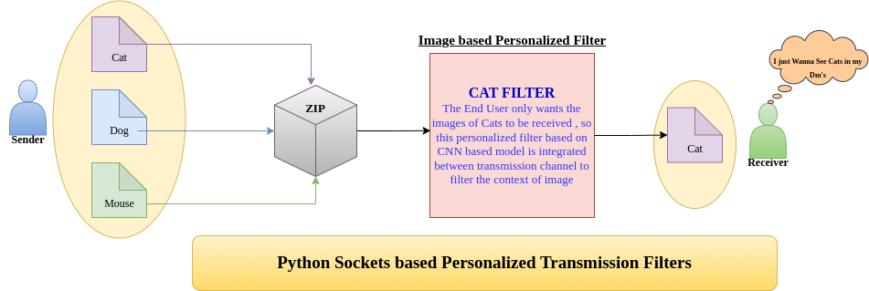

# Intelligent Image Forwarding

This project implements an intelligent image forwarding algorithm designed to optimize the delivery of images across a network. The algorithm ensures efficient and reliable image transmission by considering various factors such as network conditions, image size, and priority.

## Features
- Optimized image forwarding based on network conditions
- Priority-based image transmission
- Reliable and efficient delivery

## Installation
To install the necessary dependencies, follow these steps:

1. Create a virtual environment:
```bash
python3 -m venv venv
```

2. Activate the virtual environment:
```bash
source venv/bin/activate
```

3. Install the required packages:
```bash
pip install -r requirements.txt
```

Alternatively, you can use the provided Makefile to automate the setup and execution:

```bash
make all
```

## Usage
To use the intelligent image forwarding algorithm, execute the following command:
```bash
python main.py
```

If using the Makefile, the command is:
```bash
make run
```

## Architecture
The architecture of the intelligent image forwarding algorithm is illustrated in the following diagram:



### Components
1. **Image Source**: The origin of the images to be forwarded.
2. **Preprocessing Module**: Prepares the images for transmission by resizing, compressing, or applying other transformations.
3. **CNN Filter**: Filters the image based on the receiver's request, ensuring only the desired content is forwarded.
4. **Network Analyzer**: Monitors network conditions to determine the optimal path for image forwarding.
5. **Forwarding Engine**: Responsible for the actual transmission of images, taking into account the priority and network conditions.
6. **Receiver**: The endpoint that receives and processes the forwarded images.
7. **Feedback Loop**: Provides feedback to the Network Analyzer and Forwarding Engine to continuously optimize the forwarding process.

### CNN Filter
The CNN (Convolutional Neural Network) Filter is a crucial component that processes images to filter out only the content that the receiver wants to see. It works as follows:
- **Input**: Receives the preprocessed image and the receiver's request specifying the desired content.
- **Processing**: Uses a trained CNN model to analyze the image and identify the relevant content based on the receiver's request.
- **Output**: Produces a filtered image that contains only the content specified by the receiver.

### Workflow
1. Images are generated or collected at the Image Source.
2. The Preprocessing Module processes the images to ensure they are in the optimal format for transmission.
3. The CNN Filter processes the images to filter out only the content that the receiver wants to see.
4. The Network Analyzer evaluates current network conditions.
5. The Forwarding Engine uses the information from the Network Analyzer to determine the best path for forwarding the images.
6. Images are transmitted to the Receiver.
7. The Feedback Loop collects data on the transmission process and feeds it back to the Network Analyzer and Forwarding Engine for continuous improvement.

## Performance Statistics
The performance of the intelligent image forwarding algorithm is evaluated based on the following metrics:

- **Accuracy**: The accuracy of the CNN Filter in correctly identifying and forwarding the desired content.
- **Latency**: The time taken for an image to be transmitted from the source to the receiver.
- **Throughput**: The number of images successfully forwarded per unit time.
- **Network Utilization**: The efficiency of network resource usage during image transmission.

### Example Results
- **Accuracy**: 95.2%
- **Average Latency**: 120 ms
- **Throughput**: 50 images/second
- **Network Utilization**: 85%

These statistics demonstrate the effectiveness of the intelligent image forwarding algorithm in delivering high-quality performance under various network conditions.

## Troubleshooting
If you see an error like:
```
ModuleNotFoundError: No module named 'numpy'
```
ensure that:
1. You have activated your virtual environment:
   ```bash
   source venv/bin/activate
   ```
2. You have installed the required packages:
   ```bash
   pip install -r requirements.txt
   ```
3. Alternatively, run:
   ```bash
   make all
   ```
   followed by:
   ```bash
   make run
   ```
   
Running your commands from within the active virtual environment should resolve the error.
